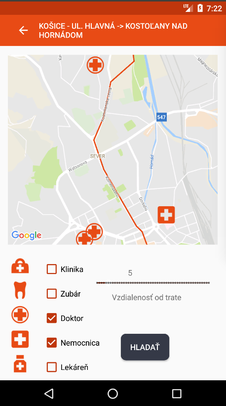

# General course assignment

Build a map-based application, which lets the user see geo-based data on a map and filter/search through it in a meaningfull way. Specify the details and build it in your language of choice. The application should have 3 components:

1. Custom-styled background map, ideally built with [mapbox](http://mapbox.com). Hard-core mode: you can also serve the map tiles yourself using [mapnik](http://mapnik.org/) or similar tool.
2. Local server with [PostGIS](http://postgis.net/) and an API layer that exposes data in a [geojson format](http://geojson.org/).
3. The user-facing application (web, android, ios, your choice..) which calls the API and lets the user see and navigate in the map and shows the geodata. You can (and should) use existing components, such as the Mapbox SDK, or [Leaflet](http://leafletjs.com/).

## Example projects

- Showing nearby landmarks as colored circles, each type of landmark has different circle color and the more interesting the landmark is, the bigger the circle. Landmarks are sorted in a sidebar by distance to the user. It is possible to filter only certain landmark types (e.g., castles).

- Showing bicykle roads on a map. The roads are color-coded based on the road difficulty. The user can see various lists which help her choose an appropriate road, e.g. roads that cross a river, roads that are nearby lakes, roads that pass through multiple countries, etc.

## Data sources

- [Open Street Maps](https://www.openstreetmap.org/)

## My project

# Overview

Aplication description:
Aplication the RUN – PDT is an extension of the aplication The RUN 2017. 
This aplication was used as the aplication of the event The RUN 2017. It was the event, when the runners run from Košice to Bratislava. That was the longest relay race in our country. This aplication was made to inform the runners about the track, check the stage and also brings information about the event. 

I made an extension of that aplication, which brings that usecases:
- Healthcare points along the stage (dentist, doctors, hospital, clinics, pharmacy). The runner may choose the distance from the stage. 
- Displays castles near the actual position of the runner (max. to 10 km). 
- Displays the list of districts (in Slovak „okres, kraj“) of the stage. 
- Displays the constrain of the stage (forest, recevoir, orchard, ...)

This is it in action:

 
 

Android application is used as client application for the runners to display and typing the input to API calls on backend side. Two of the usecases are displayed directly to the map. One of the usecases displays on the graph and the fourth usecase displays the list of districts. 

**Data source:** Open street map http://download.geofabrik.de/europe/slovakia.html
**Technology used:** PHP (Laravel),REST, Android (Clean-architecture), Postgi

**Application consist from two part:**
- Client(Frontend) - Android APP
- Backend - PHP (Laravel) APP and Postgis database

# Frontend

Android application is used as client application for the runners to display and typing the input to API calls on backend side. Two of the usecases are displayed directly to the map. One of the usecases displays on the graph and the fourth usecase displays the list of districts. 

# Backend

Backend was created by PHP framework Laravel. I created REST API interface, which making calls to postgis databse. Results of calls are in geojson format.

## Data

Stage, castel, nature type information are from Open Street Maps. I downloaded an extent covering whole Slovakia and imported it using the `osm2pgsql` tool.

## Api

I used POST api calls becouse I send data about stage (polyline).

**Find Healthcare points**

`POST /api/v1/health_car`
```
{
   "type":"doctors,clinic",
   "points":[
      {
         "lat":49.13895,
         "lng":19.94654
      },
      {
         "lat":49.13894,
         "lng":19.94631
      },
      {
         "lat":49.1389,
         "lng":19.94593
      }
   ]
}
```

**Find castle**

`POST /api/v1/castle`
```
{
   "lat":48.895655,
   "lng":18.045414
}
```


**List of districts (in Slovak „okres, kraj“) of the stage**

`POST /api/v1/administrative`
```
{
   "administrative":"okres",
   "points":[
      {
         "lat":49.13895,
         "lng":19.94654
      },
      {
         "lat":49.13894,
         "lng":19.94631
      },
      {
         "lat":49.1389,
         "lng":19.94593
      }
   ]
}
```

**Constrain of the stage (forest, recevoir, orchard, ...)**

`POST /api/v1/land_use`
```
{
   "points":[
      {
         "lat":49.13895,
         "lng":19.94654
      },
      {
         "lat":49.13894,
         "lng":19.94631
      },
      {
         "lat":49.1389,
         "lng":19.94593
      }
   ]
}
```

